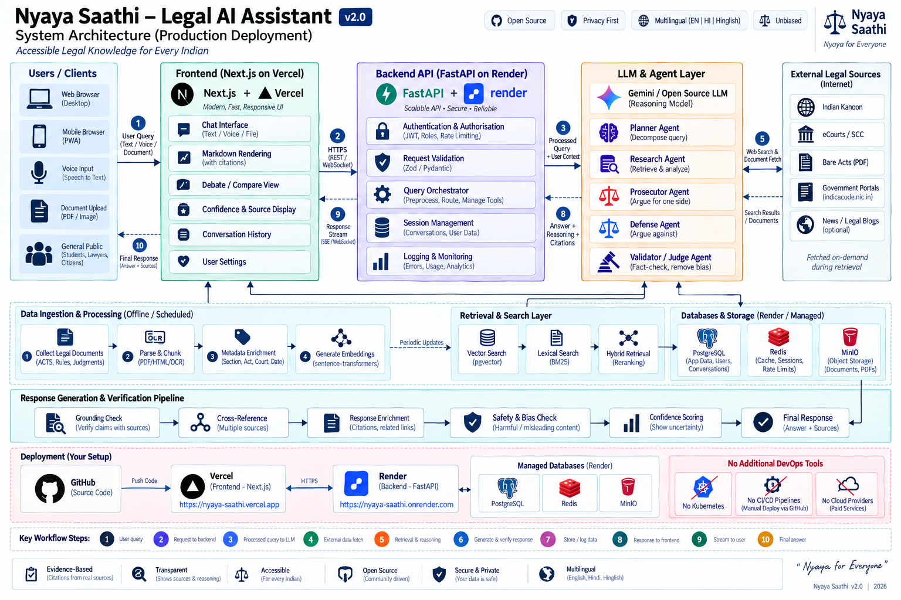
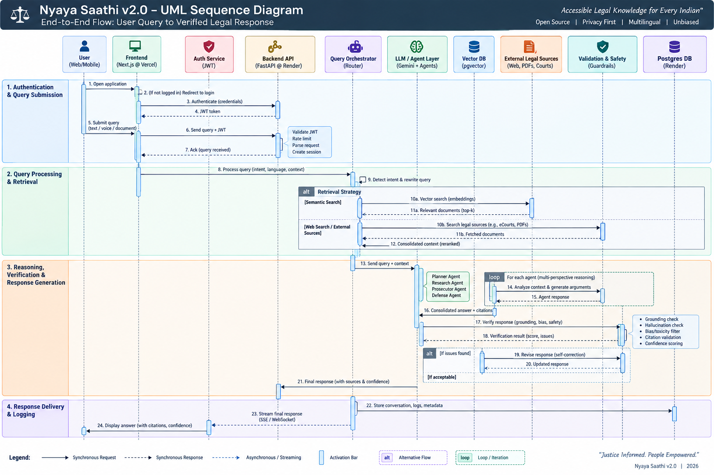

# Nyaya Saathi 2.0 ⚖️
### An Advanced Multimodal Reasoning and Multilingual RAG-Based ChatBot Web Application for Legal Queries and Procedural Workflow Guidance Under the Indian Constitution

🌐 **Live Demo:** [Deploy on Vercel](https://nyaya-saathi-eta.vercel.app/)

---

## 🎓 Capstone Project Details
* **Course:** MNNIT B.Tech CSE Sem IV (Capstone Project)
* **Course ID:** CSN14403
* **Under Guidance of:** Dr. Shashanka Srivastava (Associate Professor)
* **Developer:** Aryaman Singh
* **Registration No:** 20243510
* **Section:** CS-A

---

## 📊 System Architecture & Workflows

### Architecture Diagram

### Sequence Diagram

